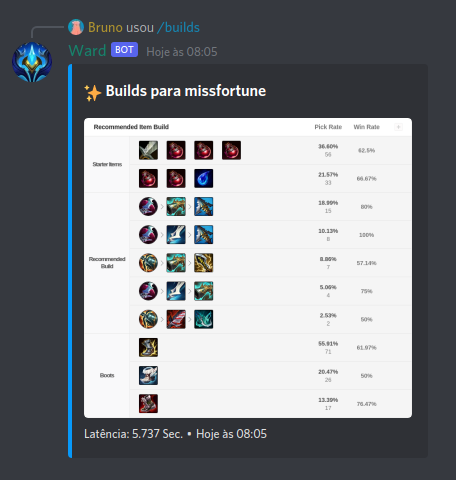
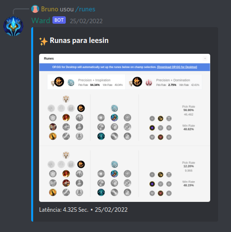
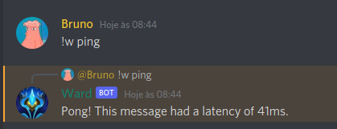

# op.gg Discord Bot
[op.gg](https://op.gg) é uma página de dados e estísticas para o jogo League of Legends, a ideia do bot é trazer os dados de spells, builds e runas do op.gg para o discord, facilitando a busca desses dados.
Para trazer os dados é feito um scraping da página, e usando o puppeteer gerar uma imagem dos blocos respondendo o chat do discord com as informações solicitadas.

## Exemplos

## Misc
Para adicionar mais commandos de barra ou de mensagem, basta criar um novo arquivo nas pastas discord-bot/commands ou discord-bot/messages, seguindo o exemplo das já existentes.

A classe DiscordBot também é um ótimo boilerplate para bots futuros, precisando trocar apenas os commandos nas pastas commands, events e messages.

Esse é meu inicio em nodeJS, então provavelmente o código possui alguns erros, caso encontre algum e queira me ajudar indicando melhorias será incrível.
